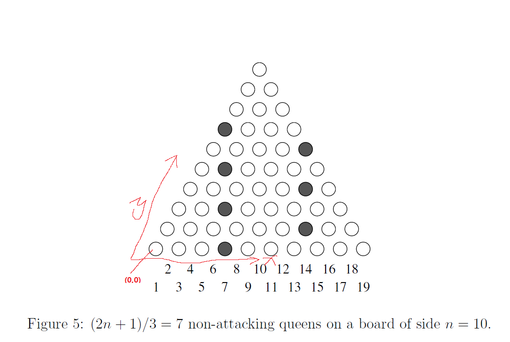

# Beautiful 3 Set
原题见[这里](https://www.hackerrank.com/challenges/beautiful-3-set/problem)

给定一个整数n。对于一个由三元组(x, y, z)构成的集合S，它被称作漂亮的当且仅当：
* 0 <= x(i), y(i), z(i)
* x(i) + y(i) + z(i) = n， 对于任意 1 <= i <= |S|，即每个三元组的三项加起来都等于n
* 假设X是集合中所有不同的x(i)组成的集合，Y是y(i)对应的集合，Z是z(i)对应的集合，则有 |X|=|Y|=|Z|，即所有的x(i)没有相同的，y(i)和z(i)也是。

给定n，构造一个漂亮的S集，使得S包括的三元组数量最大，打印出满足条件的一个S集。

# 分析
这个题目，说实话，第一反应是用穷举回溯法。为什么呢？因为其实这是一个类似八皇后的问题。

假设在二维坐标系上取点，使得x>=0,y>=0，而任一一点(x, y)对应的值是n - x - y也>=0，可以看出这是一个下三角形。以4为例，应该是长这样：
```
0
1 0
2 1 0
3 2 1 0
0 3 2 1 0
```
左下角是原点，水平方向是x轴，竖直方向是y轴。

而如果要满足题意的话，假设现在选择了任意一个点(i, j)，则第i列，第j行，以及沿着(i-1,j+1)方向的点都不能再选择了，所以这是一个类似八皇后的问题，要选择尽量多的点，使它们不能“互相攻击”。

八皇后问题，通常的解法就是穷举回溯，但是，这里不太适用，会爆炸。

然后，我自己想肯定是想不出来的，于是搜了下有没有相关的知识。显然，是有的，这种情况被叫做三角形皇后问题，这篇论文[Non-attacking queens on a triangle](./triangle-queens.pdf)

我就不详细展开讲里面的证明了，直接拿其中的结论出来说，对照论文中的图


结论如下，设每边长度为n：
* 最多能选择(2n+1)/3（向下取整）个点。
* 按图中的列序号定义方式（从1开始），分别选择第(2n + 1)/3（向下取整）列和第(4n+2)/3（向上取整）列所有点即可。

但是这张图看起来跟直角坐标系有些差距，所以我标注了一下对应的x轴，y轴，以及原点。

然后，经过转换（论文中的n对应题目中的n+1），以题目中的n为准，结果如下：
* 满足条件的点为2n/3 + 1（向下取整）个
* 以x = 0, y = 2n/3 (向下取整) 为起始点开始遍历选择，每次遍历，x = x + 1, y = y -2，直到 y < 0为止
* 以x = n/3 + 1(向上取整), y = n - x为起始点开始遍历选择，每次遍历，x = x + 1, y = y -2，直到 y < 0为止

具体代码见[solve.php](./solve.php)