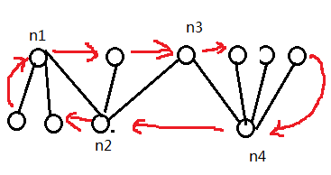

# ByteLandian Tours
原题见[这里](https://www.hackerrank.com/challenges/bytelandian-tours/problem)

N个城市，N-1条边，从每个城市都可以走到其他任何一个城市。是的，这是一棵树。

但是，那些配送员觉得现有的路走起来好麻烦，特别对于从某个城市出发，到达每个城市，最后再回到原来的城市来说，同一条路可能要重复走。

所以，现在新修了一些路，这些路用来连接两个“有点近”的城市，所谓的两个城市“有点近”，指的是，这两个城市能够通过2条原来的路到达。

举个例子，现在的道路是：
* 0 - 1 - 2 - 3 - 4

则，0跟2，1跟3，2跟4，都是“有点近”的，0跟2能够通过2条原来的路0-1, 1-2到达，其他的也是类似。

现在，加上了这些新修的路之后，某配送员从城市0（城市编号从0开始）出发，他打算遍历每个城市仅一次，最后回到城市0.

问，一共有多少种不同的遍历路径？

# 分析
从某个城市开始，遍历每个城市仅一次，最后回到城市0。这个，是[汉密尔顿回路](https://baike.baidu.com/item/%E6%B1%89%E5%AF%86%E5%B0%94%E9%A1%BF%E5%9B%9E%E8%B7%AF/20955259?fr=aladdin)。

然后，汉密尔顿回路是一个NP完备的问题。用穷举法搜索的话，我觉得，可能，我过世了还没算出来吧。

所以，肯定是有简单的计算方法的。

有时候，真的，觉得自己只有两不知，“这也不知，那也不知”。看了题目里面的讨论，并科学上网搜索一下之后，就更加意识到自己知识的浅薄。

首先，把原图中2步可达的节点连起来，这个叫做"the square of a tree"，不知道要怎么翻译，就不翻了。

然后， 有这样一个定理：
* The square of a tree T contains a Hamiltonian cycle if and only if T is a caterpillar。

caterpillar又是啥呢，要看原文的话，需要科学上网打开维基百科，见[这里](https://en.wikipedia.org/wiki/Caterpillar_tree)

首先注明一点，如果根节点也只有一个子节点的话，那么根节点也被当做叶节点处理。

这里简单说明一下，就是一棵树，然后如果这棵树去掉叶节点，只留下非叶节点的话，余下来的树，每个节点最多只有一个子节点。换句话说：每个节点的所有子节点中，非叶节点最多只有一个。
可以想象，所有的非叶节点可以排成一条线，没有分枝。

那么，如果是caterpillar的话，对应的"square tree"会有多少种汉密尔顿回路？

可以看下[这里](https://math.stackexchange.com/questions/2354550/hamiltonian-cycles-in-the-square-of-a-caterpillar-tree)

假设节点总数为n，分为两种情况：
* 形成的图形是星形，即一个节点作为中心，与其他每个节点相连，此时汉密尔顿回路总数是 (n - 1)!。
因为square tree中，任意两个节点都有边可达，因此，对于起点而言，第1步有n-1种选择，第2步有n-2种选择...第n-2步有2种选择，第n-1步有1种选择，最后从最后一个节点走回起点就好。
根据乘法公式，就是 n-1 的阶乘。
* 形成的图形不是星形。则结果是 2 * 所有非叶节点连接的叶节点数的阶乘之积。听起来又很拗口了，那换种讲法吧。
假设所有非叶节点为n1, n2, n3, ... nt，n1连接的叶节点数为m1，n2连接的叶节点数为m2... nt连接的叶节点数为mt，则结果是 2 * m1! * m2! * m3! * ... * mt!。
这个可能要看论文原文，详细了解回路的构建方式，才能够理解。

我这里尝试稍微讲一下吧。首先，将任何一个节点做为起点（也是终点），构建出的回路数量都是一样的。这个应该比较显然吧，对于任意一个环，选谁开始都是一样的。

那么，以上面的设定为例，假设以n1作为起点。而非叶节点形成的路径就是n1 - n2 - n3 - ... - nt。类似于下图：

按照顺时针的方法构建：
1. n1开始。
2. 走到连接n2的任一叶节点，遍历n2全部叶节点。
3. 走到n3。
4. 走到n4任一叶节点，遍历n4全部叶节点。
5. 走到n4。
6. 走到n3任一叶节点，遍历n3全部叶节点。注意，这里n3没有叶节点，直接跳过就好。
7. 走到n2.
8. 走到n1任一叶节点，遍历n1全部叶节点。
9. 走回n1。

所以就是，非叶节点->下一个非叶节点所有叶节点->下一个非叶节点->下一个非叶节点所有叶节点->....。如果中间到了最后一个非叶节点或最后一个非叶节点的叶节点，则往回折返，依旧如此交替。

这里，能够构建出不同走法的地方就在于每个非叶节点对应的所有叶节点的排列，因此顺时针能够构建的总数就是m1! * m2! * m3! * ... * mt!

逆时针能够构建的数量是一样的，所以数量*2 = 2 * m1! * m2! * m3! * ... * mt!

那么，是不是所有的回路都包含在以上构建的路径中，有没有可能多出来的走法呢？答案是，没有。为什么呢？易证（开玩笑的）。

首先来看为什么必须是相邻节点非叶节点和叶节点交替的走法。假设不全是这样的走法。那么，有两种情况：
* nk的叶节点连接n(k+1)的叶节点。这个，是不可能的，因为它们的距离超过2了。。。。
* nk直接连接n(k+1)。

对于第二种情况，假设这是第一次出现两个相邻叶节点直接相连，它不可能出现在返程，因为返程时，两者之一已经遍历过了，再连接就不符合回路定义。

那么它出现在去程，即nk的叶节点还未遍历过。则若nk与n(k+1)相连，则下一步必须要连接nk的叶节点，否则，之后再也连接不到它们了，因为能够连到它们的只有n(k-1)，nk，以及n(k+1)。
如果nk没有叶节点，那就得换成下一步必须连接n(k-1)，道理相同，n(k+1)以及编号更大的所有节点，都没办法再连回来了

而如果连接nk的叶节点或n(k-1)的话，再之后，就连不到n(k+1)的叶节点了，道理同上，此时必须通过nk和n(k+1)才能连接过去，而它们已经遍历过了。

所以，必须是相邻交替的走法。

另一方面，有没有可能遍历nk的叶节点时，只遍历一部分，留下一部分呢。这个，也不可能。同样的，是因为如果不全部遍历，之后就走不过来了，可以用类似以上的列举方式分析。虽然不易证，但我这里也不再一一列举了。有兴趣可以自己对着示例图分析下。

这样，最终的算法写出来是很简单的，数每个非叶节点上连接的叶节点数，按照上面的公式计算结果就行了。

但是，涉及到的数学知识好深奥，除了汉密尔顿回路，另外几个我都是第一次听说。难，太难了，看着是图论问题，其实是排列组合问题！

具体代码见[solve.php](./solve.php)