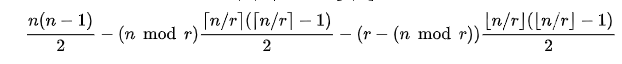

# Clique
原题见[这里](https://www.hackerrank.com/challenges/clique/problem)

一个clique，中文翻译成团，就是一个图里一部分节点组成的集合，在此集合中，任意两个节点之间都有边相连。

largest clique，最大团，就是图里所有团里，节点数量最大的（或之一）。

现在假定一个图有n个节点和m条边（注意一条边必须连接两个不同的节点，且任意两个节点之间最多有一条边），问所有可能的图中，节点数量最少的最大团，包含的节点数量是多少？

# 分析
题目中已经给了提示了，用Turan's theorem。

同时，也讲了，这里面讲的只是一个上界，那么精确的数量呢，请看[Turán graph](https://en.wikipedia.org/wiki/Tur%C3%A1n_graph)

如果没法科学上网看不了的话，请看下图。假设一共n个节点，如果最大团的节点数量是r，那么边数最多为：

现在是给定了边数，要求最大团的节点数量，就按照这个公式进行二分查找即可。

具体代码见[solve.php](./solve.php)