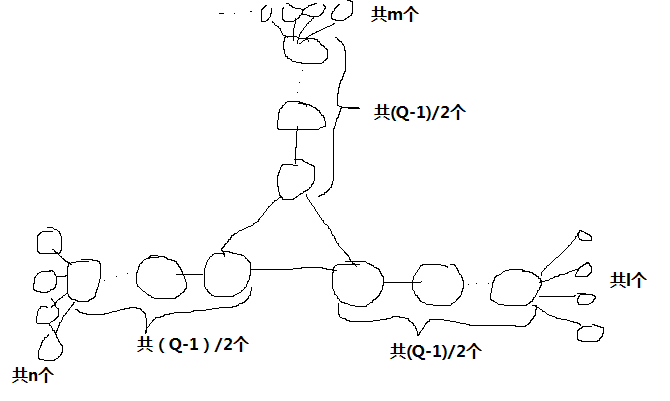
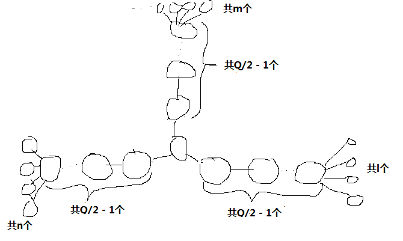

# Lovely Triplets
原题见[这里](https://www.hackerrank.com/challenges/lovely-triplets/problem)

Daniel认为拥有以下三项特征的图是“特别的”：
* 是无向图。
* 图中每条边的长度为1.
* 图中包含正好P组不同的"lovely"三元组。

三元组，顾点思义就是图中的三个不同节点。而一个三元组是"lovely"的，当且仅当其中任意两个节点的最短距离都等于Q。

对于两个三元组A和B，只要A中的任一节点不在B中，则认为A和B是不同的三元组。

现在给定P和Q，要求画出一个“特别的”图来。当然，节点和边数都是有限制的，不能超过100

# 分析
这个题目严格来说，我知道这种方法可以通过测试用例，但是没有严格的证明它一定能满足限制，也没有保证这样的构造方式得出的结果就一定是最优的图。

然而，此题的编辑也没有给出说明和答案，也只是按照这样的方法去构造图。

主要的思想就是构造不同的子图，任意两个子图之间没有交集，使得子图的"lovely"三元组的数量之和等于P。

而子图的构造方式，根据Q的情况分为以下三种情况：

## Q=2
对于这种情况，每个子图的结构都是一个点作为根，其他点都只与此根节点相连。

首先，每个子图至少有4个节点，然后，假设子图总节点数为n，则子图包含的不同三元组数量为C(n-1, 3)，这里的C就是排列组合中的组合公式。

理论上应该是用动态规划，作为背包问题来拆分成不同数量的子图的，我这里偷懒用了贪心法，即每一步构造一个小于等于当前要求数量的子图，然后将当前要求数量减去此子图的数量，再继续下一步。

## Q>2，且Q为奇数
对于这种情况，子图的结构是中间三个节点两两相连，然后再从它们分别往外延伸(Q-1)/2 - 1个节点，再将全部叶节点都连接在某一个延伸出去的最后一个节点上，如下图所示：

这样，叶节点就被分成了三组，数量分别是m,n,和l个，而满足条件的三元组总数就是m*n*l，而子图的节点总数就是m + n + l + (Q-1)/2 * 3个。

对于每个数，都可以算出将其拆成m*n*l的形式，所需的最小节点数，以及对应的拆法。

然后再做一步，看对于每个数，遍历检查，它是直接生成一张子图，还是将其拆分成左右两部分，最终需要的节点数更小。

对于这种情况，子图中的节点数与边数是相同的。

## Q>2，且Q为偶数
其实这跟Q为奇数的做法是一样的，只是中间的额外节点结构不同，数量也不同。

子图的结构是中间一个节点，向三个方向分别延伸Q/2 - 1个节点，再将全部叶节点都连接在某一个延伸出去的最后一个节点上，如下图所示：

计算方式跟Q为奇数是类似的，假设分成m,n,l，子图节点总数是 m + n + l + Q/2 * 3 - 2个。

对于这种情况，子图中的边数 = 节点数 - 1。

因为已经穷举计算出了对于每个数是应该拆分还是直接生成子图，直接递归遍历打印子图结构即可。

具体代码见[solve.php](./solve.php)