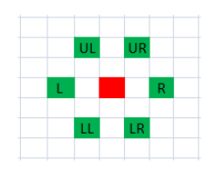

# Red Knight's Shortest Path
原题见[这里](https://www.hackerrank.com/challenges/red-knights-shortest-path/problem)

红骑士有6种移动方式，如图，红色为当前所在位置，绿色为可以移动到的位置。

给定起点和终点，输出从起点到终点所需的最小步数，以及每一步的移动方式。六种移动方式是有优先级的，左上 > 右上 > 右 > 右下 > 左下 > 左。移动时尽量先选优先级最高的。如果没法从起点走到终点，输出"Impossible"

# 分析
我的第一反应，当然是穷举法，每一步都更新当前步数，并尝试六个方向。如果找到了终点，就比较并更新最短路径。

然而，非常遗憾，这个方法确实是最终能找到相应的路线，但是，会超时。
即使用分支定界法和根据上一步的移动方向来优化本地的移动，减少穷举的数量，也是一样。

这道题，看着是搜索问题，其实，是数学计算问题！

盯着移动方式的图仔细看看，会发现：行如果发生变化，则一定变化的行数为2。
这个不需要详细证明了吧，能让行数变化的是UL,UR,LL,LR四种情况，要么上移两行，要么下移两行。

所以，可以得到第一个结论：
* 若起点与终点的行数之差为奇数，则不可达。

设起点与终点行数之差为2t，则从起点到终点所在行需要的最少步数为t， 即每次都向终点行方向跳，不走回头路。又会有一个结论
* 假设在最终最短路径中，使行数发生变化的步数为u，则必然u与t的奇偶性相同。

在这里假设最终需要下移2t行，需要上移2t行的情况可以用类似的方法证明。

设最终路径中，上移的步数为x, 下移的步数为y，有
* 2x - 2y = 2t， 即最终上移2t行
* x + y = u， 即上下移步数之和为 u

第一个等式可以简化为 x - y = t。可以看到， t为两数之差，u为两数之和， 则两者奇偶性必然相同。
这里我不再继续详细说明了，x和y的奇偶取值总共有4种组合，可以自己列个表看看。

再继续，现在到列数了，设起点与终点列数之差为v。

上面的使行数发生变化的u步，每一步也都会使行数变化1。
而剩下的两种使行数变化的方式，每一步都是使行数变化2。所以又有结论如下：
* 假设在最终最短路径中，使行数发生变化的步数为u，则u与v奇偶性相同。

这次我真的想说“易证”，用反证法。。。

以上是有无解的可行性讨论，下面说明在有解的情况下，如何找出最短路径。

要满足行数变化，至少需要t步。对于t和v，有如下两种情况：
1. v <= t。 则至少t步可以到达终点。
2. v > t。 则至少t + (v - t)/2步到达终点。

不妨设终点的列数 > 起点的列数， 相反的情况可以用类似的方法证明。假设t步中使列变小的步数为left，使列变大的步数为right。

对于第一种情况，有：

 left + right = t, 且 right - left = v。 可以行到 right = (t + v)/2, left = (t-v)/2 。
由于t >= v且t和v奇偶性相同，因此left和right都是大于等于0的整数，这样移动就可以到达终点。

对于第二种情况。首先，由于列数变化至少v， 而t步行数变化最多使列数变化t。
因此列数变化至少需要额外的 v - t，只能通过两种平移来达到， 所以至少要t + (v - t)/2步到达终点。

移动的方法同时也出来了，t步全部选择使列变大的方向， 剩下的(v-t)/2步平移也选择使列变大的方向。 

最终处理过程如下：
1. 计算起终点行数之差，判断奇偶性，不满足则输出无解，退出，否则算出需上下移动的步数t，继续。
2. 计算起终点列数之差v，判断奇偶性条件，不满足则输出无解，否则继续。
3. 根据v与t的大小关系，计算各种移动方式需要的步数。输出总步数，并按优先级输出每步移动方式。
  
具体代码见[solve.php](./solve.php)