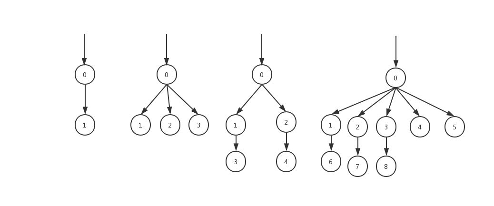

# Repair Roads
原题见[这里](https://www.hackerrank.com/challenges/repair-roads/problem)
就是N个城市，N-1条路（双向边），城市两两连通。  
现在所有的路要翻修一遍，用机器人来做这事。  
对于一个机器人，如果它修好了一条路，那么下一步可以继续修另一条与此路相连的未被修过的路，继续工作。  
同一条路，不能被访问两次。如果一个机器人无法移动了，并且还存在未修的路，而需要再派一个机器人，重复上面的工作，直到所有的路都修好为止。
现在的问题是，对于给定的图，最少需要多少个机器人。

# 分析
首先，这是一个没有环的图，可以看作是树状结构。  
然后，我思考了一下，问题等价于将图划分成多个子部分，每个部分可以变相的一笔画。 这里的变相指的是，画完一条边后，可以从此边连接的任一节点继续画。 
对于这样的一笔画，除了特殊情况外，必然从一个叶节点开始，以另一个叶节点结束（特殊情况其实也可以算是叶节点开始，叶节点结束，下面会详细讲解）。  
那么，这条路径，对于开始和结束的两个叶节点而言，必然会经过它们共同的父节点。
另一方面，除了特殊情况外，一个叶节点也必然作为开始节点，或结束节点。
所以，对于一个非叶节点，可以把它的所有子节点中的叶节点两两组合，形成一条路径，自底向上依次遍历，就能得到最小路径数。

下面对于非叶节点的连接情况具体分析，会同时讲到上面说的叶节点一般情况和特殊情况。

结合图片分析，对于任意一个非叶节点，其子节点有如下几种情况：
* 子节点只包括单个叶节点，如最左图。这样的叶节点就是上面说的一般情况，此叶节点必然作为一笔画的起点或终点。
证明比较简单，对于0，有两条边要遍历，如果先遍历 0-1这条边， 则1必然是作为起点，因为没有其他路径可以走到0了。当然可以说是从0开始，第一步是 0 -> 1，但这跟从1开始是等价的。
如果后遍历0-1这条边，那么1必然是终点，因为之后，没有其他路可以走了。
* 子节点只包括多个叶节点，如左二。这样的情况，其实跟只包括单个叶节点是等价的。根据上面说的变相的一笔画，画完 0-2和0-3之后，还是可以继续从0开始遍历。
可以看作，在遍历到0节点时，可以先将2，3遍历了，再继续原有的遍历方式。因此，对于多个叶节点，可以看作只有一个叶节点。
* 子节点只包括多个非叶节点，如左三。对于这样的情况，可以将非叶节点两两组合，形成若干条一笔画路径，并将已组合的节点移除掉。
若最后没有子节点了，则此节点也可被移除掉，因为通向父节点的边，可以在任意一次组合时遍历掉。
* 子节点同时包括多个非叶节点和多个叶节点，如右一。跟情况2类似，多个叶节点可以等价于单个叶节点，而且始终可以顺带消除。而非叶节点可以跟情况3一样两两消除。

用result记录最终路径条数，对于每个节点，需要记录两个信息，是否是叶节点isLeaf和是否已经移除isRemove。  
算法流程如下：
1. 记录节点的邻居关系。
2. 设置result为0, 将每个节点isRemove和isLeaf设置为false.
3. 以任一节点作为根节点，假设是u，其父节点v设为空，调用process(u, v)，其中process(u, v)步骤如下，是一个递归函数：
    * 用两个临时变量,一个是subCount，记录u的非叶子节点数，一个是hasLeaf，记录u是否有叶节点。
    * 对于u的每个邻居节点w
        * 如果w是u的父节点，即w = v，什么也不做
        * 递归调用process(w, u)
        * 如果w.isRemove为true，什么也不做。否则，检查w.isLeaf，如果为true，设置hasLeaf为true，否则subcount加1
    * 如果subcount > 0，即u有非叶子节点。
        * 令 mod = subCount % 2， 非叶子节点两两组合， result = result + (subCount - mod) / 2
        * 如果 mod 等于 0 ，说明全部组合完毕， 设置 u.isRemove为 true， 否则设置 u.isLeaf为false
    * 如果subcount = 0
        * 如果hasLeaf为true，表示u需要作为非叶节点处理，设置u.isLeaf为false，否则设置u.isLeaf为true
4. 对根节点额外判断，如果其所有邻居都已经被移除了，什么也不做,否则result加1.

具体代码见[solve.php](./solve.php)