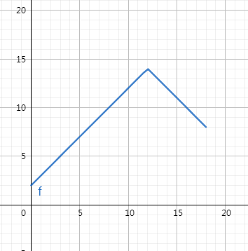
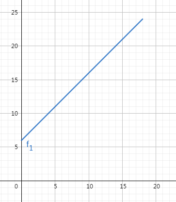
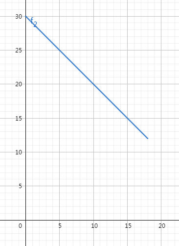
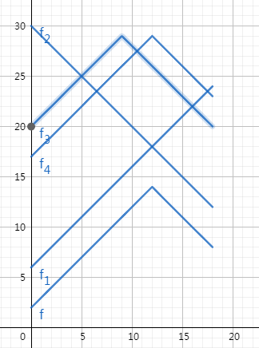

# Savita And Friends
原题见[这里](https://www.hackerrank.com/challenges/savita-and-friends/problem)

N个城市，M条路。即N个点，M条无向边，构成一个连通图。

需要在编号为K（编号从1开始）的边上选择一个点，使得从此点到所有点的最短路径中的最大距离最小。这个讲法有点绕，拆成两句话来说吧。
对于K上的每个点，都可以计算出它到所有城市的最短路径，然后得到所有这些路径中的最大值。现在需要做的事，找到一个点，使得计算出的最大值小于等于K上其他点计算出的最大值。

假设编号为K的边连接的是A和B，按题目给的顺序，A在前，B在后，输出此点离A的距离，同时输出对应的所有最短路径中的最大距离。
如果有多个解，输出离A更近的距离。

# 分析
这道题有种说不清楚的感觉，特别是第二部分，只是对着函数坐标图心里觉得“这样是可以得出最后答案的”，但要严格证明的话，无从下笔根本开始不了一郎。我努力尝试讲解吧:(

还是分成两步来考虑吧。

## 计算两端节点最短路径
首先，从K上选择一个点，则从其出发到所有点的最短路径，要么最先经过A，要么最先经过B。这个应该真的很显然了，要么往边的某一头走，要么往另一头走。

假设选择的这个点为Z，则，可以进一步推导出，Z到某个节点C的最短路径，要么是Z到A，然后加上A到C的最短路径，要么是Z到B，再加上B到C的最短路径，取两者的最小值。这个，大概也不需要证明吧。

所以第一步，就是求出A和B到所有节点的最短路径。这个，当然，是用迪克(杰)斯特拉算法。

本来我应该从头开始讲这个算法的，但是，但是我在另一道题里讲过了，就不再复制粘贴一遍了，见[这里](../Dijkstra-Reach2)

还是要提醒一句，实现的时候，对于找当前路径长度最小的一项时，用堆来处理。我不知道其他语言怎么样，我用的PHP，不用堆的话后面好几个Test Case都会超时。
至于堆，当然也不是自己从头实现，我用的是SplPriorityQueue，其他语言中应该也有类似自带的的数据结构吧，用它们。

## 找出使最短路径最大值最小的点
假设d(i, j)表示i与j节点的最短路径的长度，连接A和B的K的长度为c，有：
* 对于任意i, |d(a, i) - d(b, i)| <= c
即i到A的最短距离，与i到B的最短距离，两者相差不会超过K的长度。只需要证明d(a, i) >= d(b, i)的情况即可，反过来的情况可以同理得出。

假设 d(a, i) - d(b, i) > c，则 d(b, i) + c < d(a, i)， 也就是说，从i到b的最短距离，再加上走K到a，距离要比 i到a的最短距离还要短，这样就构成了一条更短的从i到a的路径，与d的定义矛盾。

设对于i节点来说，K上选择的点Z到A的距离为x时，对应的Z到i的最短路径为f(i, x)，根据上一步，取两种路径的最小值，有
* f(i, x) = min(x + d(a, i), c - x + d(b ,i))
则对于两种路径的大小，有如下两种情况：
1. x + d(a, i) <= c - x + d(b , i)， 此时有 x <= (c + d(b , i) - d(a, i))/2
2. 与1相反， x > (c + d(b , i) - d(a, i))/2

即可以看做一个分段函数，前半段单调递增，后半段单调递增。而当|d(a, i) - d(b, i)| = c时，会只有前半段或后半段。此函数可能的图形如下：

如果将全部i对应的分段函数都画在同一个坐标系中，可能就是这样了。

数学中一个重要的方法是什么呢？观察，发现规律，并进行证明。当然，对于提交而言，不需要证明，只要利用发现的规律提交结果通过了就行。但这里，我们还是要本着刨根问底拦不住的精神，证明它的正确性。

（待续，临时提交...）

具体代码见[solve.php](./solve.php)