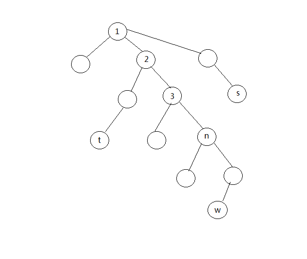

# Tree Flow
原题见[这里](https://www.hackerrank.com/challenges/tree-flow/problem)

对于一棵树T，共n个节点，定义dist[u][v]为从节点u到节点v的最短路径的所有边的长度之和。

定义n*n二维矩阵A，对于A有如下规则：
* A[u][v] = -A[v][u]
* 0 <= |A[u][v]| <= dist[u][v]
* 对于任意 u != 1且 u != n，都有 A[u][1] + A[u][2] + A[u][3] + ... + A[u][n-1] + A[u][n] = 0

对于所有可能的矩阵A，求如下公式的最大值。
* A[1][1] + A[1][2] + A[1][3] + ... + A[1][n-1] + A[1][n]

# 分析
这道题可以看做是对一个完全图求最大流。所谓完全图，就是任意两个顶点之间都有边相连，每两个顶点u,v之间的边的就是dist[u][v]。现在要求的，就是以1为起点，以n为终点的最大流。

但是，真的要两两计算出dist，内存肯定就超了，因此，必然是有更加简单的解法的。

首先，对于每个节点u，构建一条1 -> u -> n的路径，则这条路径上能通过的最大流就是min(dist[1][u], dist[u][n])，这个真的很显然了吧，一条路径上的最大流，就是所有边的容量中的最小值。

此时对A矩阵做相应的赋值，对于所有的节点u, A[1][u] = A[u][n] = min(dist[1][u], dist[u][n])， A[u][1] = A[n][u] = - min(dist[1][u], dist[u][n])

对于节点u。
* 如果dist[1][u] < dist[u][n]，那么，A[1][u]已经是能够取到的最大值了，同时，u -> n这条路径还有剩余容量，即还能接收其他节点过来的流量，再输出到n。
* 如果dist[1][u] >= dist[u][n]， 那么 1 -> u这条路径还有剩余容量，但如果要继续提高A[1][u]，则必须将多出来的这些流量分给其他节点。

那么可以看到，情况1中的节点还可以帮其他节点分担多余的流量，情况2的节点需要其他节点帮助分担流量，那么，就把情况2的节点流量分担给情况1中的节点吧。

但是现在有一个问题，假设节点u可以分担流量f(u)，而节点v需要分担流量g(v)，而v -> u能够容纳的最大流量为dist[v][u]，这样一来，岂不还是得两两求出dist，再依次将流量分担出去呢？

有没有可能，dist[v][u] >= min(f(u), g(v))，不需要考虑节点之间边的容量，只需要比较需要分担的流量和可以分担的流量就好了呢？

答案是，是的！下面来证明这一点。

假设从1到n的最短路径为P 1 -> t1 -> t2 -> t3 -> ... -> n，则对于任一节点u, 1到u的最短路径和u到n的最短路径会在P上有唯一一个共同点c，同时这两条路径的重合部分为c->u(不考虑路径方向)。

参考上图，1到n的最短路径P为 1->2->3->n， 以1到s和s到n的最短路径交点为1，重合部分为1->s， 1到t和t到n的最短路径交点为2，重合部分为2->t， 1到w和w到n的最短路径交点为n，重合部分为n->w。

那么就有 dist[1][u] - dist[u][n] = dist[1][c] - dist[c][n]， 也就是构建1->u->路径操作之后的-f(u)(当dist[1][c] < dist[c][n])或是 g(u)(当dist[1][u] >= dist[u][n])

则对于两个点t1和t2，进行完构建首条路径操作后,t1可以分担流量，而t2需要分担流量，它们在P上肯定对应不同的点，假设它们在P上对应的上述共同点分别为c1和c2，则必然c1比c2更靠近起点1.

假设dist[1][c1] = i, dist[c1][c2] = j, dist[c2][n] = k，有：
* g(t2) = i + j - k >= 0
* f(t1) = k + j - i >= 0
令 i - k = m，则有 min(f(t1), g(t2)) = min (j + m, j - m) <= j，即 min(f(t1), g(t2)) <= dist[c1][c2] <= dist[t1][t2]。

而接下来每步操作，都是将某些流量从某个节点u分担给另一个节点v，也就是所有的g(u)和f(v)都是在逐渐减小的，而dist是保持不变的，而任意两个节点u和v，只可能分担一次，因此始终不会出现路径容量不够的情况。

所以只需要求出1到所有点的路径长度，和n到所有点的路径长度，然后按照上面的说法，第一步，加上所有min(dist[1][u], dist[u][n])，第二步，加上需要分担总流量和可以分担总流量的较小者即可。

不过这里我其实处理复杂了一点分成了两步，实际上只要一次性迭代求出1到所有点的最短路长度之和，以及n到所有点的最短长度之和，取两者的最小值即可，但是这个代码我就不写了，你可以思考下在现有的代码基础上如何改。

最后，依照惯例，我用的PHP，为了防止内存超出，做了一些特殊的处理。

具体代码见[solve.php](./solve.php)